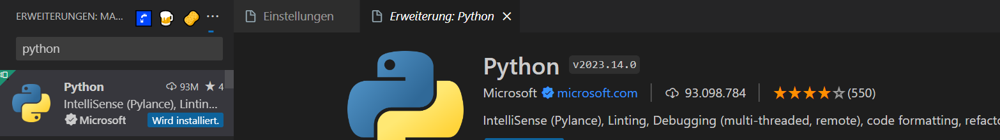

# Willkommen in der Suva

&nbsp;
## Vorstellung

| Levin Zimmermann | 2. Lehrjahr |
| ---------------- | ----------- |
| Alter| 17 |
| Hobbies | Schlagzeug |
| Job | KungFu Shark |

| Manuel Leon Wicki | 2. Lehrjahr |
| ---------------- | ----------- |
| Alter| 16 |
| Hobbies | Server, Kellerkind |
| Job | Serra |

| Sven Lussmann | 3. Lehrjahr |
| ---------------- | ----------- |
| Alter| 26 |
| Hobbies | Wandern, Kochen, Wellness, Pilze sammeln |
| Job | KungFu Shark |
&nbsp;
&nbsp;

## Tagesplanung
| Morgens | |
| ---- | ----- |
| 08:00 | Vorstellung von uns |
| 08:15 | ÜK Notebooks aufsetzen |
| 08:30 | Github |
| 08:45 | Plug-Ins Visual Studio |
| 09:00 | Pause/Kaffee |
| 09:30 | Einführung in Html und Css |
| 10:00 | Eigene Webseite erstellen (Cheatsheet) |
| 10:30 | Vorstellung von euch mittels eigener Webseite |
| 11:40 | Kahoot zu Lehre (Appli) |
| 12:00 | Mittag |

| Nachmittags | |
| ---- | ----- |
| 13:00 | Einführung JavaScript |
| 13:30 | Aufgaben JavaScript |
| 15:00 | Pause/Kaffee |
| 15:30 | Schulische Sachen...? |
| 15:45 | Pandora? (Berufsschule) |
&nbsp;
&nbsp;
## ÜK Notebooks aufsetzen
|Benötigte Programme | DownloadLink |
| ---------------------------------- | --------------------------- |
| Visual Studio Code (Alle Sprachen) | https://code.visualstudio.com/ |
| Visual Studio (C#) | https://visualstudio.microsoft.com/de/ |
| XAMPP | https://www.apachefriends.org/de/download.html |
| Azure / MySQL | https://azure.microsoft.com/de-de/products/azure-sql |
| Discord | https://discord.com/download |
&nbsp;
      
|Github                              |       https://github.com/   | 
| ---------------------------------- | --------------------------- |
| Konto erstellen                    |  |
| Repository forken                  |  |
| Repository forken GUI              |  |
| Repository klonen                  |  |
| Repository klonen URL              |  |
| Repository Url in Vs Code kopieren |  |
&nbsp;

## Visal Studio Plug-Ins

| Plug-In | Link |
| ------- | ---- |
| Prettier |  |
| AutoSave |  |
| Python |  |
| C# Extension |  |
| Go Lang |  | 
| Java |  |
&nbsp;
## Einführung in HTML & CSS

- Cheatsheet
- Einführung Powerpoint
&nbsp;
## Eigene Webseite erstellen
- Versucht, eurer Kreativität freien Lauf zu lassen.
- Ihr habt dafür 30 Minuten Zeit.
- Was alles auf die Webseite muss / Ziele:
- Versucht die Aufgaben ohne ChatGPT zu lösen.
### Hilfestellungen:
- [Hilfe HTML](https://www.w3schools.com/html/)
- [Hilfe CSS](https://www.w3schools.com/css/)
- [Hilfe JS](https://www.w3schools.com/js/)
&nbsp;
## Vorstellung von euch

## Kahoot
- [Kahoot](https://kahoot.it/)
## JavaScript
- Einführung Powerpoint

## Aufgaben JavaScript
- Selbstständiges Arbeiten
- Bei Fragen FRAGT Levin. He the Goat of js 
## Drucker Pin setzen
- [Drucker Pin setzen](https://wiki.suvanet.ch/pages/viewpage.action?pageId=325008139&preview=%2F325008139%2F325008184%2FDrucker+PIN+setzen.pdf)
## Schulische Sachen
| Lehrperson | Pros | Cons |
| ---------- | ---- | ---- |
| Stefan Lagger | - Hilfsbereit (Auch ausserhalb Bürozeiten!)   - Freundlich   - Mit guter Rethorik kann man bei ihm etwas erreichen. |  - Aufmerksam sein, sonst wird er streng.  |
|Roland Bucher | - Hilfsbereit (Auch ausserhalb Bürozeiten!)   - Sehr freundlich   - Gute Kentnisse   - Mit guter Rethorik kann man bei ihm viel erreichen.| - Hausaufgaben sollten immer erledigt werden. |
|Peter Kaufmann | - Kopfhörer, offene Dosen. |
| Markus Ineichen | - Nett   - Man kann eigentlich gut mit ihm diskutieren | - Leider versteht er den Stoff z.T. selber nicht.   - Sehr trockener Unterricht. |

## Fragen zur Lehre?
- BM?
- Sprachaufenthalte?
- First / Delph
- Achtung Tastatur etc. können geklaut werden. Laptops einschliessen oder nach Hause nehmen!!
Auf Laptop aufpassen...