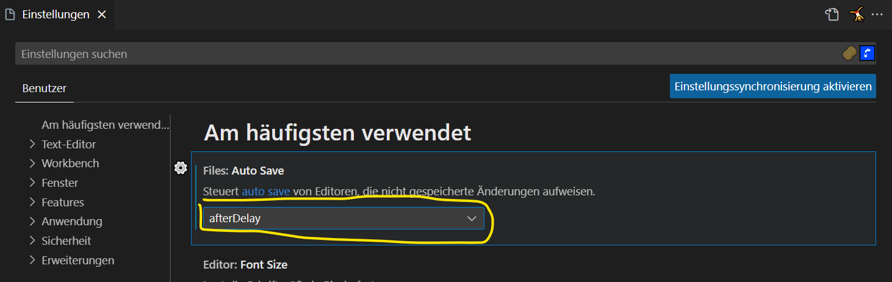
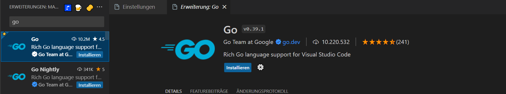

# Willkommen in der Suva

&nbsp;
## **Vorstellung**

| Levin Zimmermann | 2. Lehrjahr |
| ---------------- | ----------- |
| Alter| 17 |
| Hobbies | Schlagzeug |
| Job | KungFu Shark |

| Manuel Leon Wicki | 2. Lehrjahr |
| ---------------- | ----------- |
| Alter| 16 |
| Hobbies | Server, Kellerkind |
| Job | Serra |

| Sven Lussmann | 3. Lehrjahr |
| ---------------- | ----------- |
| Alter| 26 |
| Hobbies | Wandern, Kochen, Wellness, Pilze sammeln |
| Job | KungFu Shark |
&nbsp;
&nbsp;

## **Tagesplanung**
| Morgens | |
| ---- | ----- |
| 08:00 | Vorstellung von uns |
| 08:15 | ÜK Notebooks aufsetzen |
| 08:30 | Github |
| 08:45 | Plug-Ins Visual Studio |
| 09:00 | Pause/Kaffee |
| 09:30 | Einführung in Html und Css |
| 10:00 | Eigene Webseite erstellen (Cheatsheet) |
| 10:30 | Vorstellung von euch mittels eigener Webseite |
| 11:40 | Kahoot zu Lehre (Appli) |
| 12:00 | Mittag |

| Nachmittags | |
| ---- | ----- |
| 13:00 | Einführung JavaScript |
| 13:30 | Aufgaben JavaScript |
| 15:00 | Pause/Kaffee |
| 15:30 | Schulische Sachen...? |
| 15:45 | Pandora? (Berufsschule) |
&nbsp;
&nbsp;
## **ÜK Notebooks aufsetzen**
|Benötigte Programme | DownloadLink |
| ---------------------------------- | --------------------------- |
| Visual Studio Code (Alle Sprachen) | https://code.visualstudio.com/ |
| Visual Studio (C#) | https://visualstudio.microsoft.com/de/ |
| XAMPP | https://www.apachefriends.org/de/download.html |
| Azure / MySQL | https://azure.microsoft.com/de-de/products/azure-sql |
| Discord | https://discord.com/download |
&nbsp;
      
|Github                              |       https://github.com/   | 
| ---------------------------------- | --------------------------- |
| Konto erstellen                    |  |
| Repository forken                  |  |
| Repository forken GUI              |  |
| Repository klonen                  |  |
| Repository klonen URL              |  |
| Repository Url in Vs Code kopieren |  |
&nbsp;

## **Visal Studio Plug-Ins**

| Plug-In | Link |
| ------- | ---- |
| Prettier |  |
| AutoSave |  |
| Python |  |
| C# Extension |  |
| Go Lang |  | 
| Java |  |
&nbsp;
## **Einführung in HTML & CSS**

- Cheatsheet
  Einführung Powerpoint
&nbsp;
## **Eigene Webseite erstellen**
- Versucht, eurer Kreativität freien Lauf zu lassen.
- Ihr habt dafür 30 Minuten Zeit.
- Was alles auf die Webseite muss / Ziele:
- Versucht die Aufgaben ohne ChatGPT zu lösen.
- **Hilfestellungen:**
- https://www.w3schools.com/html/
- https://www.w3schools.com/css/
- https://www.w3schools.com/js/
&nbsp;
## **Vorstellung von euch**

:D

## **JavaScript**

Einführung Powerpoint?

## **Aufgaben JavaScript**

## **Drucker Pin setzen**

## **Schulische Sachen**

- Stefan Lagger: aufpassen wegen aufmerksamkeit und nicht am Pc sein, sonst ist er angepisst.
- Roland Bucher: aufpassen, Hausaufgaben erledigen.
- Peter Kaufmann: Kopfhörer, offene Dosen.
- Markus Ineichen: Eigentlich netter Lehrer, aber manchmal nicht wirklich Ahnung vom Thema.

## **Fragen zur Lehre?**

Achtung Tastatur etc. können geklaut werden. Laptops einschliessen oder nach Hause nehmen!!
Auf Laptop aufpassen...