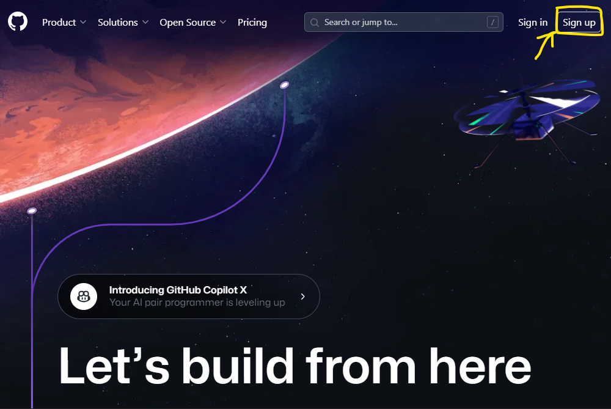

# Willkommen in der Suva

## **Vorstellung**

| Name             | Lehrjahr |
|:-----------------|:--------:|
| Levin Zimmermann |    2.    |
| Manuel Wicki     |    2.    |
| Sven Lussmann    |    3.    |

### Levin Zimmermann

- Alter: &nbsp;&nbsp;&nbsp;&nbsp;&nbsp;&nbsp; 17
- Hobbies: &nbsp;Schlagzeug
- Job: &nbsp;&nbsp;&nbsp;&nbsp;&nbsp;&nbsp;&nbsp;&nbsp;&nbsp;KungFu Shark

### Manuel Wicki

- Alter: &nbsp;&nbsp;&nbsp;&nbsp;&nbsp;&nbsp; 16
- Hobbies: &nbsp;Server, Kellerkind
- Job: &nbsp;&nbsp;&nbsp;&nbsp;&nbsp;&nbsp;&nbsp;&nbsp;&nbsp;Serra

### Sven Lussmann

- Alter: &nbsp;&nbsp;&nbsp;&nbsp;&nbsp;&nbsp; 26
- Hobbies: &nbsp;Wandern, Kochen, Wellness, Pilze sammeln
- Job: &nbsp;&nbsp;&nbsp;&nbsp;&nbsp;&nbsp;&nbsp;&nbsp;&nbsp;KungFu Shark

## **Tagesplanung**

### **Morgens**
- **08:00** &nbsp;&nbsp;-&nbsp; Vorstellung von uns...
- **08:15** &nbsp;&nbsp;-&nbsp; ÜK Notebooks aufsetzen
- **08:30** &nbsp;&nbsp;-&nbsp; Github
- **08:45** &nbsp;&nbsp;-&nbsp; Plug-Ins Visaul Studio
- **09:00** &nbsp;&nbsp;-&nbsp; Pause/Kaffee
- **09:30** &nbsp;&nbsp;-&nbsp;&nbsp;Einführung in Html und Css
- **10:00** &nbsp;&nbsp;-&nbsp;&nbsp;   |-> `Eigene Webseite erstellen`
- **10:30** &nbsp;&nbsp;-&nbsp;&nbsp;   |-> `Vorstellung von euch mittels eigener Webseite (Cheatsheet)`
- **11:40** &nbsp;&nbsp;-&nbsp; Kahoot zu Lehre (Appli)
- **12:00** &nbsp;&nbsp;-&nbsp; Mittag

### **Nachmittags**
- **13:00** &nbsp;&nbsp;-&nbsp; Einführung JavaScript
- **13:30** &nbsp;&nbsp;-&nbsp; Aufgaben JavaScript
- **15:00** &nbsp;&nbsp;-&nbsp; Pause/Kaffee
- **15:30** &nbsp;&nbsp;-&nbsp; Schulische Sachen...?
- **15:45** &nbsp;&nbsp;-&nbsp; Pandora? (Berufsschule)

## **ÜK Notebooks aufsetzen**
**Benötigte Programme:**
- Visual Studio Code (Alle Sprachen) &nbsp;&nbsp;&nbsp;&nbsp;:&nbsp;&nbsp;&nbsp;&nbsp;&nbsp;&nbsp;https://code.visualstudio.com/
- Visual Studio (C#)&nbsp;&nbsp;&nbsp;&nbsp;&nbsp;&nbsp;&nbsp;&nbsp;&nbsp;&nbsp;&nbsp;&nbsp;&nbsp;&nbsp;&nbsp;&nbsp;&nbsp;&nbsp;&nbsp;&nbsp;&nbsp;&nbsp;&nbsp;&nbsp;&nbsp;&nbsp;&nbsp;&nbsp;&nbsp;&nbsp;&nbsp;&nbsp;:&nbsp;&nbsp;&nbsp;&nbsp;&nbsp;&nbsp;https://visualstudio.microsoft.com/de/
- XAMPP&nbsp;&nbsp;&nbsp;&nbsp;&nbsp;&nbsp;&nbsp;&nbsp;&nbsp;&nbsp;&nbsp;&nbsp;&nbsp;&nbsp;&nbsp;&nbsp;&nbsp;&nbsp;&nbsp;&nbsp;&nbsp;&nbsp;&nbsp;&nbsp;&nbsp;&nbsp;&nbsp;&nbsp;&nbsp;&nbsp;&nbsp;&nbsp;&nbsp;&nbsp;&nbsp;&nbsp;&nbsp;&nbsp;&nbsp;&nbsp;&nbsp;&nbsp;&nbsp;&nbsp;&nbsp;&nbsp;&nbsp;&nbsp;&nbsp;:&nbsp;&nbsp;&nbsp;&nbsp;&nbsp;&nbsp;https://www.apachefriends.org/de/download.html
- Azure / MySQL&nbsp;&nbsp;&nbsp;&nbsp;&nbsp;&nbsp;&nbsp;&nbsp;&nbsp;&nbsp;&nbsp;&nbsp;&nbsp;&nbsp;&nbsp;&nbsp;&nbsp;&nbsp;&nbsp;&nbsp;&nbsp;&nbsp;&nbsp;&nbsp;&nbsp;&nbsp;&nbsp;&nbsp;&nbsp;&nbsp;&nbsp;&nbsp;&nbsp;&nbsp;&nbsp;&nbsp;&nbsp;:&nbsp;&nbsp;&nbsp;&nbsp;&nbsp;&nbsp;https://azure.microsoft.com/de-de/products/azure-sql
- Discord&nbsp;&nbsp;&nbsp;&nbsp;&nbsp;&nbsp;&nbsp;&nbsp;&nbsp;&nbsp;&nbsp;&nbsp;&nbsp;&nbsp;&nbsp;&nbsp;&nbsp;&nbsp;&nbsp;&nbsp;&nbsp;&nbsp;&nbsp;&nbsp;&nbsp;&nbsp;&nbsp;&nbsp;&nbsp;&nbsp;&nbsp;&nbsp;&nbsp;&nbsp;&nbsp;&nbsp;&nbsp;&nbsp;&nbsp;&nbsp;&nbsp;&nbsp;&nbsp;&nbsp;&nbsp;&nbsp;&nbsp;&nbsp;&nbsp;:&nbsp;&nbsp;&nbsp;&nbsp;&nbsp;&nbsp;https://discord.com/download

## **Visual Studio Code Plug-Ins**

| Github            ||
| ------            | ------ |
| Konto erstellen   |  |
| Visual Studio mit Github verbinden |  |
| Repository forken |  |
| Repository forken GUI |  |
| Repository klonen |  |
| Repository klonen GUI |  |
| Commit mit GUI |  |
| Synchro mit GUI |  |

## **Github**
- Konto erstellen -> https://github.com/
- Visual Studio Code mit Github verbinden
- Repository forken
- Repository klonen mit GUI
- Commit mit GUI
- Synchro mit GUI

## **Visal Studio Plug-Ins**
- Prettier
- AutoSave
- Python
- C# Extension
- Go Lang -> Kompillation funktioniert nicht auf Windows
- Java

## **Einführung in HTML & CSS**
- Cheatsheet
Einführung Powerpoint

## **Eigene Webseite erstellen**
- Versucht, eurer Kreativität freien Lauf zu lassen.
- Ihr habt dafür 30 Minuten Zeit.

- Was alles auf die Webseite muss / Ziele:

- Versucht die Aufgaben ohne ChatGPT zu lösen. 
- **Hilfestellungen:**
- https://www.w3schools.com/html/
- https://www.w3schools.com/css/
- https://www.w3schools.com/js/

## **Vorstellung von euch**
:D

## **JavaScript**
Einführung Powerpoint?
## **Aufgaben JavaScript**

## **Drucker Pin setzen**

## **Schulische Sachen**
- Stefan Lagger: aufpassen wegen aufmerksamkeit und nicht am Pc sein, sonst ist er angepisst.
- Roland Bucher: aufpassen, Hausaufgaben erledigen.
- Peter Kaufmann: Kopfhörer, offene Dosen.
- Markus Ineichen: Eigentlich netter Lehrer, aber manchmal nicht wirklich Ahnung vom Thema.

## **Fragen zur Lehre?**
Achtung Tastatur etc. können geklaut werden. Laptops einschliessen oder nach Hause nehmen!!
Auf Laptop aufpassen...
